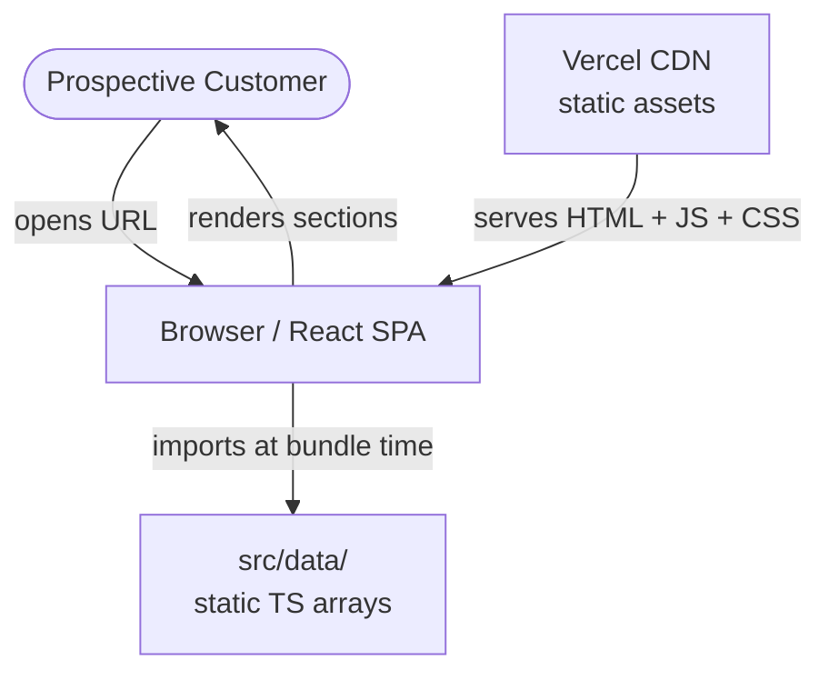
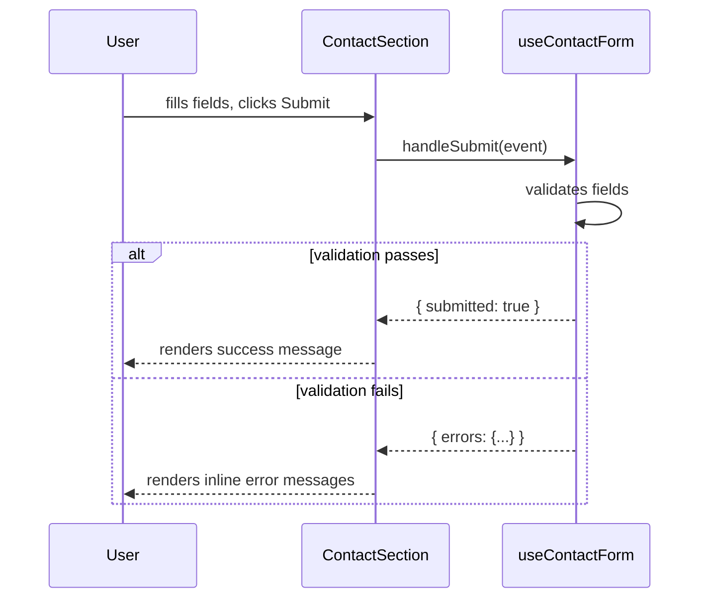
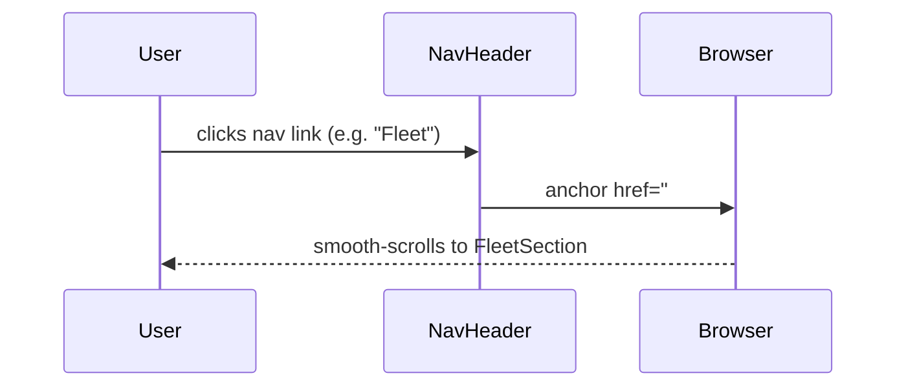
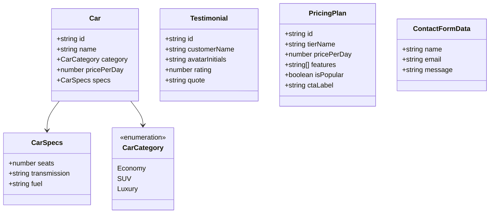

# Architecture — DriveEasy Car Rentals Landing Page

## 1. Overview

DriveEasy Car Rentals is a single-page marketing site for a fictional car
rental company. Prospective customers land on this page to browse available
cars, understand the rental process, compare pricing tiers, and submit a
contact inquiry. The site has no backend — all data is static and hardcoded.
This is an MVP: the first shippable version targeting early visibility and
conversion via a Vercel-hosted SPA.

## 2. Solution type and scope

**Type:** MVP

**In scope:**

- Sticky responsive navigation header with anchor-scroll links (F001)
- Full-width hero section with two CTAs (F002)
- Fleet showcase grid of 6 static car cards (F003)
- How It Works three-step process section (F004)
- Testimonials grid with 4 static reviews (F005)
- Pricing plans with 3 tiers, one highlighted (F006)
- Contact form (client-side only, success message on submit) + footer (F007)
- Deployment to Vercel (FDEPLOY)
- Anchor-scroll navigation between all named sections

**Out of scope:**

- Real booking or reservation backend
- Authentication or user accounts
- Payment processing
- Actual car images (CSS gradient placeholders used instead)
- Database or any persistence layer
- External API calls of any kind
- Server-side rendering (SSR)
- Internationalisation (i18n)
- Analytics or tracking integrations

**Assumptions:**

- All car, testimonial, and pricing data is hardcoded in `src/data/` as
  TypeScript arrays; no fetch call is ever made at runtime.
- The contact form submits to no endpoint — a success message is shown by
  toggling component state.
- CSS custom properties from `src/theme/tokens.css` (generated by the
  designer) are the sole source of colors, spacing, radius, and typography.
- The site must render correctly on modern browsers (Chrome, Firefox, Safari,
  Edge); IE11 is not supported.
- No UI component library is used; all components are hand-built.

## 3. Functional requirements

FR-1 (F001): A sticky navigation bar renders the DriveEasy logo, five anchor
links (Home, Fleet, How It Works, Pricing, Contact), and a "Book Now" CTA
button. It collapses to a hamburger toggle on mobile viewports.

FR-2 (F002): A full-width hero section renders a bold headline, subheadline,
brief value proposition, and two CTA buttons ("Browse Fleet", "Learn More")
over a CSS-gradient background. The section carries `id="home"`.

FR-3 (F003): A fleet showcase section renders a responsive grid of exactly
6 car cards sourced from `src/data/cars.ts`. Each card shows a CSS image
placeholder, car name, category badge, price per day, three specs (seats,
transmission, fuel), and a "Rent Now" button. The section carries `id="fleet"`.

FR-4 (F004): A "How It Works" section renders three sequential steps — each
with an icon, step title, and description — in a row on desktop and stacked
on mobile. The section carries `id="how-it-works"`.

FR-5 (F005): A testimonials section renders 4 review cards sourced from
`src/data/testimonials.ts`. Each card shows avatar initials in a colored
circle, customer name, star rating (1–5), and quote text.

FR-6 (F006): A pricing section renders 3 tier cards sourced from
`src/data/pricing.ts`. Each card shows tier name, price per day, a feature
list, and a CTA button. One card is visually distinguished as "Most Popular".
The section carries `id="pricing"`.

FR-7 (F007): A contact section renders a form with name, email, and message
fields plus a submit button. On submission, form state is replaced by a
success message (no real API call). The section carries `id="contact"`. A
footer below the form shows the logo, quick nav links, made-up address/phone,
and copyright text.

FR-8 (FDEPLOY): The built SPA is deployed to Vercel and a live HTTPS URL is
reported.

## 4. Non-functional requirements

| Attribute       | Target                                                                       | Rationale                                   | Priority |
| --------------- | ---------------------------------------------------------------------------- | ------------------------------------------- | -------- |
| Performance     | Lighthouse performance >= 85 on mobile                                       | First impressions matter for conversions    | must     |
| Accessibility   | No critical axe-core violations; keyboard-navigable                          | Reach widest audience; legal hygiene        | must     |
| Maintainability | TypeScript strict; no `any` at boundaries; 80 %+ test coverage of components | Small team, long life                       | must     |
| Responsiveness  | Usable at 320 px, 768 px, 1280 px+ viewports                                 | Majority of rental lookups are mobile-first | must     |
| Build size      | Gzipped JS bundle < 150 kB                                                   | No runtime deps beyond React; achievable    | should   |
| Observability   | Browser console clean (no errors/warnings)                                   | Minimum bar for MVP                         | should   |

## 5. System context

The site is a purely client-side SPA. The browser fetches the static assets
from Vercel's CDN and renders them entirely on the client. There are no
external APIs, no backend, and no databases at runtime.



## 6. Component breakdown

### File map

```
src/
  components/
    NavHeader/
      NavHeader.tsx          — Sticky top nav, hamburger toggle state
      NavHeader.css
    HeroSection/
      HeroSection.tsx        — Full-width hero, headline + two CTAs
      HeroSection.css
    FleetSection/
      FleetSection.tsx       — Section wrapper; renders CarCard grid
      FleetSection.css
      CarCard.tsx            — Single car card (name, badge, specs, CTA)
      CarCard.css
    HowItWorksSection/
      HowItWorksSection.tsx  — Three-step process row/stack
      HowItWorksSection.css
    TestimonialsSection/
      TestimonialsSection.tsx — Grid of TestimonialCard components
      TestimonialsSection.css
      TestimonialCard.tsx    — Avatar, name, stars, quote
      TestimonialCard.css
    PricingSection/
      PricingSection.tsx     — Row/stack of PricingCard components
      PricingSection.css
      PricingCard.tsx        — Tier name, price, features, CTA; highlighted variant
      PricingCard.css
    ContactSection/
      ContactSection.tsx     — Contact form + success-message toggle
      ContactSection.css
    Footer/
      Footer.tsx             — Logo, quick links, address, copyright
      Footer.css
  data/
    cars.ts                  — Static array of Car objects (6 entries)
    testimonials.ts          — Static array of Testimonial objects (4 entries)
    pricing.ts               — Static array of PricingPlan objects (3 entries)
  hooks/
    useContactForm.ts        — Form field state + validation + submission handler
  theme/
    tokens.css               — Generated by designer; CSS custom properties
  App.tsx                    — Assembles all sections in document order
  main.tsx                   — React root mount
```

### Critical-path interaction: contact form submission



### Nav anchor-scroll interaction



## 7. Data model

All data types live in `src/data/` and are imported directly by the relevant
section components. No runtime fetch occurs.



## 8. Technology decisions

| Decision         | Chosen option                                | Alternatives considered | Rationale                                                              |
| ---------------- | -------------------------------------------- | ----------------------- | ---------------------------------------------------------------------- |
| Framework        | React 19 + TypeScript (strict)               | Vue 3, Svelte           | Project constraint; best team familiarity                              |
| Build tool       | Vite                                         | CRA, Parcel             | Project constraint; fast HMR, native ESM, first-class TS support       |
| Styling approach | Plain CSS modules co-located with components | Tailwind, CSS-in-JS     | No UI library constraint; keeps bundle lean; tokens enforced via lint  |
| Static data      | TypeScript arrays in `src/data/`             | JSON files, CMS         | No backend; TS gives type safety at no cost; simplest approach for MVP |
| Testing          | Vitest + React Testing Library               | Jest, Playwright        | Project convention; RTL encourages accessible queries                  |
| Hosting          | Vercel                                       | Netlify, GitHub Pages   | Project constraint                                                     |
| Routing          | Anchor-scroll only (no router)               | React Router            | SPA with no separate routes; a router adds complexity with no benefit  |

## 9. Risks and trade-offs

1. Risk: CSS-only image placeholders may feel unpolished to early users.
   Impact: low — expectation is set; real images are out of scope for MVP.
   Mitigation: use visually distinct gradient placeholders with car category
   labels to maintain readability.

2. Risk: Contact form has no real submission target; users who submit receive
   a fake success.
   Impact: medium — could mislead visitors.
   Mitigation: add visible disclaimer text ("This form is a demo") near the
   submit button.

3. Risk: Anchor-scroll navigation breaks if section IDs drift from nav hrefs
   during development.
   Impact: medium — broken navigation is obvious but embarrassing.
   Mitigation: verify each anchor in the acceptance tests for F001.

4. Risk: No analytics means no conversion data to improve the page post-launch.
   Impact: low for MVP — analytics are out of scope; note for post-MVP.
   Mitigation: document as a known gap for the next iteration.

## 10. Definition of done

- [ ] All seven feature components render without console errors or warnings.
- [ ] `npm run typecheck` exits 0 (strict TypeScript, no `any` at boundaries).
- [ ] `npm run lint` exits 0.
- [ ] `npm run test` exits 0 with at least one test per component.
- [ ] `npm run design:check` exits 0 (no hardcoded color/spacing values).
- [ ] Every section has the correct `id` attribute for anchor navigation.
- [ ] NavHeader hamburger toggle works on a 375 px viewport.
- [ ] Contact form shows success message on valid submission and errors on
      invalid submission.
- [ ] Lighthouse mobile performance score >= 85 on the Vercel preview URL.
- [ ] No critical axe-core accessibility violations on any section.
- [ ] FDEPLOY: live HTTPS URL reported and accessible.
